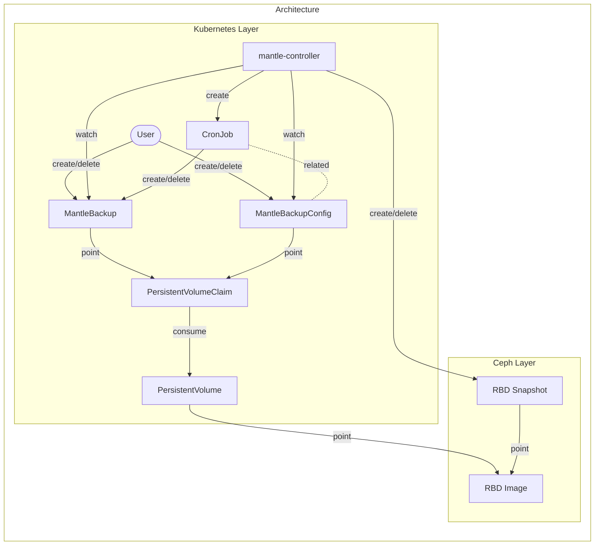

# Design notes

## Motivation

We want to backup and restore RBD PVCs managed by a Rook/Ceph cluster, either by user operation or by periodic automatic processes. Also, we want to copy backup data to another Rook/Ceph cluster in another data center.

## Goal

1. Backup arbitrary RBD PVCs.
2. Restore RBD PVCs from backups.
3. Backup arbitary RBD PVCs periodically.
4. Copy backup data to another cluster in another data center.

Currently, the goal 1 and 3 are implemented. Other goals will be achieved later.

## Architecture



mantle-controller exists for each Rook/Ceph cluster.

### Backup flow

To create/delete a backup, mantle works as follows:

1. Users create/delete `MantleBackup`.
2. rbd-backupsystem-controller (the controller) gets the target PVC from `MantleBackup`.
3. The controller gets the PV from the target PVC.
4. The controller gets the RBD image name and pool name from the PV.
5. The controller creates/deletes an RBD snapshot corresponding to the backup in the target RBD image.

### Periodic backup flow

To create and rotate backups periodically, Mantle works as follows:

1. Users create a `MantleBackupConfig`.
2. The mantle-controller then creates a `CronJob` based on the `MantleBackupConfig`.
3. The Pod, which is periodically created by the `CronJob`, creates a new `MantleBackup` and deletes any expired `MantleBackup` resources.

If a `MantleBackupConfig` is deleted, the associated `MantleBackup`s won't be removed automatically and won't expire on their own. The users need to delete them manually if they wish to do so.

### Sample manifests

A sample manifest of `MantleBackup` is as follows:

```yaml
apiVersion: mantle.cybozu.io/v1
kind: MantleBackup
metadata:
  name: <MantleBackup resource name>
spec:
  # The name of the backup target PVC
  pvc: <target PVC name>
status:
  conditions:
    # The corresponding backup data is ready to use if `status` is "True"
    - type: "ReadyToUse"
      status: "True"
```

A sample manifest of `MantleBackupConfig` is as follows:

```yaml
apiVersion: mantle.cybozu.io/v1
kind: MantleBackupConfig
metadata:
  name: test-mbc # resource name
spec:
  pvc: test-pvc # target PVC name
  schedule: 0 12 * * * # backup schedule in a crontab format.
  expire: 2w # when the MantleBackups generated by this MantleBackupConfig should expire.
  suspend: false # whether the periodic backup is active or not.
```
