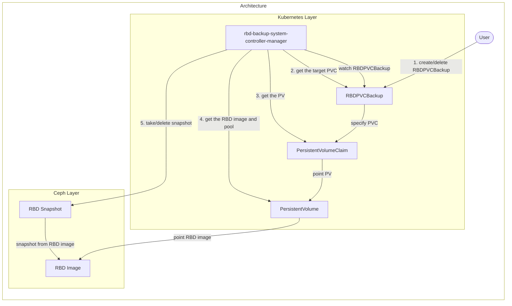

# Design notes

## Motivation

We want to back up volumes, either by user operation or by periodic automatic processes. Also, we want to perform replication to and from another cluster.

## Goal

(Currently only can manually take backups.)

- Users can back up volumes for each PVC.

## Target

- Ceph Block Device (RBD)

## Architecture



### How rbd-backup-system works

To take/delete a backup (RBD snapshot), rbd-backup-system works as follows:

1. Create/Delete `RBDPVCBackup` by the user.
2. Get the target PVC from `RBDPVCBackup`.
3. Get the PV from the target PVC.
4. Get the RBD image and pool from the PV.
5. Take/Delete an RBD snapshot for the RBD image.

### Details

The `RBDPVCBackup` resource format is as follows:

```yaml
apiVersion: backup.cybozu.com/v1
kind: RBDPVCBackup
metadata:
  name: <RBDPVCBackup resource name>
spec:
  pvc: <target PVC name>
```

- `<target PVC name>` is the backup target.
