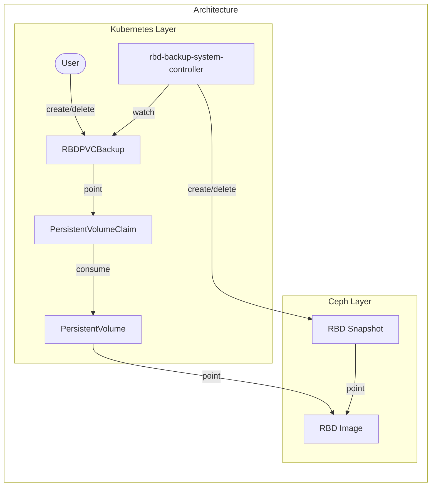

# Design notes

## Motivation

We want to backup and restore RBD PVCs managed by a Rook/Ceph cluster, either by user operation or by periodic automatic processes. Also, we want to copy backup data to another Rook/Ceph cluster in another data center.

## Goal

1. Backup arbitrary RBD PVCs.
2. Restore RBD PVCs from backups.
3. Backup arbitary RBD PVCs periodically.
4. Copy backup data to another cluster in another data center.

Currently, only 1 is implemented. Other goals will be achieved later.

## Architecture



rbd-backup-system-controller-manager exists for each Rook/Ceph cluster.

### Backup flow

To create/delete a backup, rbd-backup-system works as follows:

1. Users create/delete `RBDPVCBackup`.
2. rbd-backupsystem-controller (the controller) gets the target PVC from `RBDPVCBackup`.
3. The controller gets the PV from the target PVC.
4. The controller gets the RBD image name and pool name from the PV.
5. The controller creates/deletes an RBD snapshot corresponding to the backup in the target RBD image.

### Definitions

The definition `RBDPVCBackup` is as follows:

```yaml
apiVersion: backup.cybozu.com/v1
kind: RBDPVCBackup
metadata:
  name: <RBDPVCBackup resource name>
spec:
  pvc: <target PVC name>
```

- `<target PVC name>` is the name of the backup target PVC.
