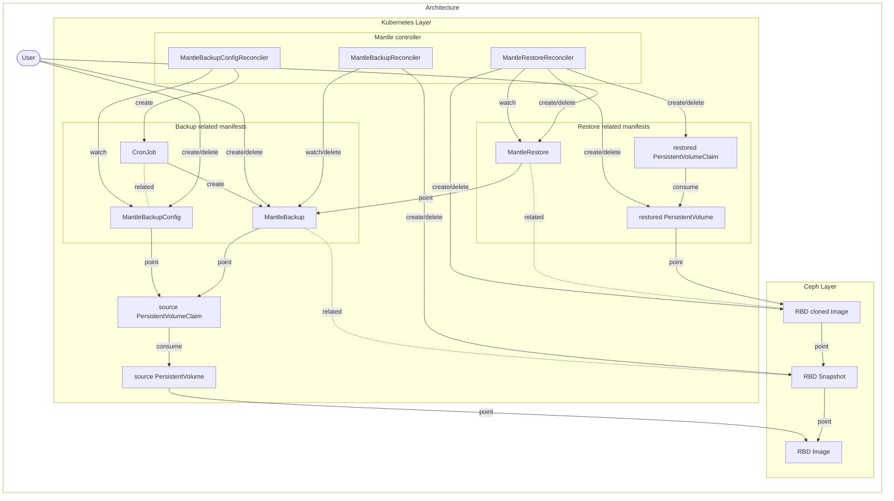

# Design notes

## Motivation

We want to backup and restore RBD PVCs managed by a Rook/Ceph cluster, either by user operation or by periodic automatic processes. Also, we want to copy backup data to another Rook/Ceph cluster in another data center.

## Goal

1. Backup arbitrary RBD PVCs.
2. Restore RBD PVCs from backups.
3. Backup arbitrary RBD PVCs periodically.
4. Copy backup data to another cluster in another data center.

Currently, the goal 1, 2, and 3 are implemented. Other goals will be achieved later.

## Architecture



mantle-controller exists for each Rook/Ceph cluster.

### Backup flow

To create/delete a backup, mantle works as follows:

1. Users create/delete `MantleBackup`.
2. rbd-backupsystem-controller (the controller) gets the target PVC from `MantleBackup`.
3. The controller gets the PV from the target PVC.
4. The controller gets the RBD image name and pool name from the PV.
5. The controller creates/deletes an RBD snapshot corresponding to the backup in the target RBD image.

### Periodic backup flow

To create backups periodically, Mantle works as follows:

1. Users create a `MantleBackupConfig`.
2. The mantle-controller then creates a `CronJob` based on the `MantleBackupConfig`.
3. The Pod, which is periodically created by the `CronJob`, creates a new `MantleBackup` resources.

If a `MantleBackupConfig` is deleted, the associated `MantleBackup`s won't be removed automatically. The users need to delete them manually if they wish to do so, or use expiration.

### Backup expiration flow

`MantleBackup` resource has an `expire` field. If time will pass the `expire` duration, the controller will delete the `MantleBackup` resource.
This process can be stopped by adding `mantle.cybozu.io/retain-if-expired` annotation to the `MantleBackup` resource.

`MantleBackupConfig` also has an `expire` field. The `CronJob` set the value to the `MantleBackup` resource created by the `MantleBackupConfig`. Therefore, the periodic backups will be deleted automatically.

### Sample manifests

A sample manifest of `MantleBackup` is as follows:

```yaml
apiVersion: mantle.cybozu.io/v1
kind: MantleBackup
metadata:
  name: <MantleBackup resource name>
  namespace: <should be the same as the target PVC>
spec:
  # The name of the backup target PVC
  pvc: <target PVC name>
  expire: 2w # when the MantleBackup should expire.
status:
  conditions:
    # The corresponding backup data has been captured if `status` is "True".
    - type: "SnapshotCaptured"
      status: "True"
```

A sample manifest of `MantleBackupConfig` is as follows:

```yaml
apiVersion: mantle.cybozu.io/v1
kind: MantleBackupConfig
metadata:
  name: test-mbc # resource name
spec:
  pvc: test-pvc # target PVC name
  schedule: 0 12 * * * # backup schedule in a crontab format.
  expire: 2w # when the MantleBackups generated by this MantleBackupConfig should expire.
  suspend: false # whether the periodic backup is active or not.
```

### Restore flow

Precondition: Process will not start until conditions are met.
- The target MantleBackup must exist and be ready to use.

1. Users create a `MantleRestore` resource.
2. The controller gets the target MantleBackup from the `MantleRestore` resource.
3. The controller stores the pool name for the `status.pool` field and cluster ID for the `status.clusterID` field. This value is used to remove the restored PV/PVC when the MantleRestore resource is deleted.
4. The controller gets backup target RBD snapshot name from the MantleBackup.
5. The controller creates a new RBD clone image from the RBD snapshot.
6. The controller creates a new PV/PVC using the above-mentioned RBD clone image.

### Cleanup restore flow

1. Users delete the `MantleRestore` resource.
2. The controller tries to delete the PV/PVC created by the `MantleRestore` resource and wait until the Pod consuming the PV/PVC are stopped and deleted.
3. The controller removes the RBD clone image created by the `MantleRestore` resource. However, the controller should not remove the RBD clone image if the previous step is not completed and a PV/PVC exists.

#### The manifest to get restore PV/PVC from a backup

```yaml
apiVersion: mantle.cybozu.io/v1
kind: MantleRestore
metadata:
  name: <MantleRestore resource name>
  namespace: <should be the same as the target MantleBackup>
spec:
  # The name of the restore target backup
  backup: <MantleBackup resource name>
status:
  conditions:
    # The corresponding restore PV/PVC is ready to use if `status` is "True"
    - type: "ReadyToUse"
      status: "True"
```
