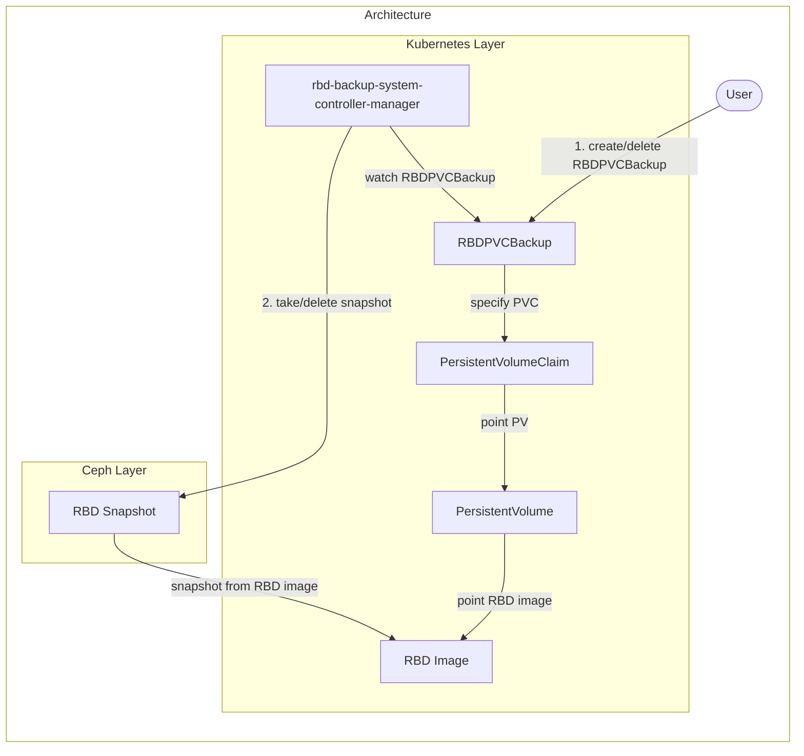

# Design notes

## Motivation

We want to back up volumes, either by user operation or by periodic automatic processes. Also, we want to perform replication to and from another cluster.

## Goal

(Currently only has the ability to manually take backups.)

- Users can back up volumes for each PVC.

## Target

- Ceph Block Device (RBD)

## Architecture

### How rbd-backup-system works

TBD

### Details

TBD
