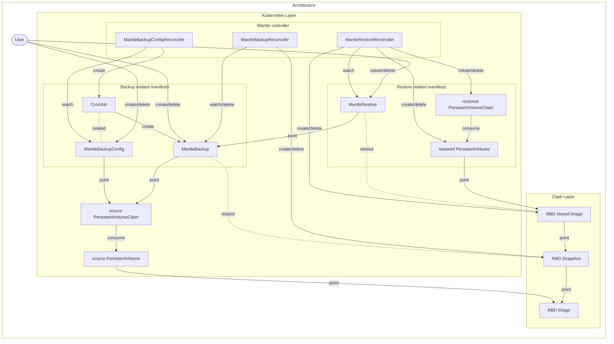

# Design notes

## Motivation

We want to backup and restore RBD PVCs managed by a Rook/Ceph cluster, either by user operation or by periodic automatic processes. Also, we want to copy backup data to another Rook/Ceph cluster in another data center.

## Goal

1. Backup arbitrary RBD PVCs.
2. Restore RBD PVCs from backups.
3. Backup arbitrary RBD PVCs periodically.
4. Copy backup data to another cluster in another data center.

Currently, the goal 1, 2, and 3 are implemented. Other goals will be achieved later.

## Architecture


```mermaid
%%{init:{'theme': 'default'}}%%

flowchart LR

    style Architecture fill:#FFFFFF

    USER([User])

    subgraph Architecture

      %% restore
      MR -- point --> MB
      MRR -- watch --> MR
      MRR -- create/delete --> RC
      MRR -- create/delete --> RES_PVC
      MRR -- create/delete --> RES_PV
      USER -- create/delete --> MR
      RES_PVC -- consume --> RES_PV
      MR -.-|related| RC
      RES_PV -- point --> RC
      RC -- point --> RS

      %% backup config
      MBCCronJob -- create --> MB
      MBCR -- watch --> MBC
      MBC -- point --> SRC_PVC
      MBCR -- create --> MBCCronJob
      MBCCronJob -.-|related| MBC
      
      %% backup
      MB -.-|related| RS
      USER -- create/delete --> MB
      MBR -- watch/delete --> MB
      MB -- point --> SRC_PVC
      SRC_PVC -- consume --> SRC_PV
      USER -- create/delete --> MBC
      MBR -- create/delete --> RS
      SRC_PV -- point --> RI
      RS -- point --> RI


      subgraph Ceph Layer
        RI[RBD Image]
        RS[RBD Snapshot]
        RC[RBD cloned Image]
      end

      subgraph Kubernetes Layer
        
        SRC_PVC[source PersistentVolumeClaim]
        SRC_PV[source PersistentVolume]

        subgraph Mantle controller
          MBCR[MantleBackupConfigReconciler]
          MBR[MantleBackupReconciler]
          MRR[MantleRestoreReconciler]
        end

        subgraph Backup related manifests
          MBC[MantleBackupConfig]
          MBCCronJob[CronJob]
          MB[MantleBackup]
        end

        subgraph Restore related manifests
          MR[MantleRestore]
          RES_PVC[restored PersistentVolumeClaim]
          RES_PV[restored PersistentVolume]
        end
      end
    end
```

mantle-controller exists for each Rook/Ceph cluster.

### Backup flow

To create/delete a backup, mantle works as follows:

1. Users create/delete `MantleBackup`.
2. rbd-backupsystem-controller (the controller) gets the target PVC from `MantleBackup`.
3. The controller gets the PV from the target PVC.
4. The controller gets the RBD image name and pool name from the PV.
5. The controller creates/deletes an RBD snapshot corresponding to the backup in the target RBD image.

### Periodic backup flow

To create backups periodically, Mantle works as follows:

1. Users create a `MantleBackupConfig`.
2. The mantle-controller then creates a `CronJob` based on the `MantleBackupConfig`.
3. The Pod, which is periodically created by the `CronJob`, creates a new `MantleBackup` resources.

If a `MantleBackupConfig` is deleted, the associated `MantleBackup`s won't be removed automatically. The users need to delete them manually if they wish to do so, or use expiration.

### Backup expiration flow

`MantleBackup` resource has an `expire` field. If time will pass the `expire` duration, the controller will delete the `MantleBackup` resource.
This process can be stopped by adding `mantle.cybozu.io/retain-if-expired` annotation to the `MantleBackup` resource.

`MantleBackupConfig` also has an `expire` field. The `CronJob` set the value to the `MantleBackup` resource created by the `MantleBackupConfig`. Therefore, the periodic backups will be deleted automatically.

### The clean snapshot metadata on the secondary cluster

Before an import Job applies an exported diff to the destination RBD image, the head of
the image must be exactly the same as the source snapshot of the diff. The import Job
used to run `rbd snap rollback` every time to guarantee this. However, its cost is
proportional to the image size, even when the image needs no rollback at all.

To skip such unnecessary rollbacks, mantle records the state of the image head in the
RBD image metadata `mantle.clean-snap` of the destination image. The metadata holds the
name of the snapshot the image head is identical to. The import Job removes the metadata
before it modifies the image, and sets it again once the image reaches a known state. If
the metadata is absent, the state of the image head is unknown, and the Job rolls the
image back as before.

The zeroout Job also removes this metadata before it modifies the image, and it doesn't
zero the image unless it is sure that the metadata is gone. This is necessary because
the full import following the zeroout may never happen, e.g., when the full backup is
deleted or expires in between; a later incremental import must then roll the image back.
Full imports still discard the metadata before they use it, for compatibility with older
zeroout Jobs that didn't invalidate it.

Import and zeroout Jobs use `podReplacementPolicy: Failed` so that normal Pod replacement
waits for the previous Pod to terminate. Otherwise, overlapping Pods of the same Job could
modify the image between an import and its clean-snap update. The controller also applies
this policy when it reconciles existing Jobs, without changing their Pod templates.
This does not stop Pods that are already overlapping or fence a writer after a forced Pod
deletion. Before forcing replacement of an unreachable Pod, ensure that the old writer
can no longer access the image.

> [!IMPORTANT]
> Only mantle may modify the head of the destination images on the secondary cluster. If
> another program writes to such an image without removing the metadata, mantle may skip
> a rollback that is actually necessary, and the imported backup may be corrupted.
>
> For the same reason, if you downgrade mantle to a version that doesn't know this
> metadata, you must remove the metadata from every destination image before you upgrade
> mantle again:
>
> ```console
> $ rbd image-meta remove <pool>/<image> mantle.clean-snap
> ```

Note that `rbd clone` copies all the metadata of the parent image to the clone, so the
images cloned from a destination image, i.e., the images of `MantleRestore` and the
temporary images used to verify a backup, also have this metadata. It is meaningless
there and mantle never reads it, because those images are never the destination of an
import.

### Skipping an import that has already been applied

`rbd import-diff` creates the snapshot at the end of the diff only after it has applied
the whole diff, and it aborts with `EEXIST` if that snapshot already exists. Therefore,
if an import Job failed after its `rbd import-diff` had succeeded, e.g., while it was
recording the clean snapshot metadata, retrying the same Job as it is would fail forever:
the Job would never complete, and mantle would never release the lock of the volume, which
blocks the subsequent backups of the same volume as well.

To avoid this, the import Job is told the name of the snapshot its `rbd import-diff`
creates, and it skips both the rollback and the import if that snapshot already exists.
The existence of the snapshot tells nothing about the current contents of the image head,
so the clean snapshot metadata is left untouched on this path.

This assumes that the name of the snapshot identifies the import uniquely. It does,
because mantle removes the snapshot of a `MantleBackup` from the destination image when
the `MantleBackup` is deleted, and because the snapshots between the parts of a multipart
import are named after the UID of the `MantleBackup` on the primary cluster.

### Sample manifests

A sample manifest of `MantleBackup` is as follows:

```yaml
apiVersion: mantle.cybozu.io/v1
kind: MantleBackup
metadata:
  name: <MantleBackup resource name>
  namespace: <should be the same as the target PVC>
spec:
  # The name of the backup target PVC
  pvc: <target PVC name>
  expire: 2w # when the MantleBackup should expire.
  transferCompression: zstd # compression format for data transferred to the secondary.
status:
  conditions:
    # The corresponding backup data has been captured if `status` is "True".
    - type: "SnapshotCaptured"
      status: "True"
```

A sample manifest of `MantleBackupConfig` is as follows:

```yaml
apiVersion: mantle.cybozu.io/v1
kind: MantleBackupConfig
metadata:
  name: test-mbc # resource name
spec:
  pvc: test-pvc # target PVC name
  schedule: 0 12 * * * # backup schedule in a crontab format.
  expire: 2w # when the MantleBackups generated by this MantleBackupConfig should expire.
  transferCompression: zstd # compression format for data transferred to the secondary.
  suspend: false # whether the periodic backup is active or not.
```

### Restore flow

Precondition: Process will not start until conditions are met.
- The target MantleBackup must exist and be ready to use.

1. Users create a `MantleRestore` resource.
2. The controller gets the target MantleBackup from the `MantleRestore` resource.
3. The controller stores the pool name for the `status.pool` field and cluster ID for the `status.clusterID` field. This value is used to remove the restored PV/PVC when the MantleRestore resource is deleted.
4. The controller gets backup target RBD snapshot name from the MantleBackup.
5. The controller creates a new RBD clone image from the RBD snapshot.
6. The controller creates a new PV/PVC using the above-mentioned RBD clone image.

### Cleanup restore flow

1. Users delete the `MantleRestore` resource.
2. The controller tries to delete the PV/PVC created by the `MantleRestore` resource and wait until the Pod consuming the PV/PVC are stopped and deleted.
3. The controller removes the RBD clone image created by the `MantleRestore` resource. However, the controller should not remove the RBD clone image if the previous step is not completed and a PV/PVC exists.

#### The manifest to get restore PV/PVC from a backup

```yaml
apiVersion: mantle.cybozu.io/v1
kind: MantleRestore
metadata:
  name: <MantleRestore resource name>
  namespace: <should be the same as the target MantleBackup>
spec:
  # The name of the restore target backup
  backup: <MantleBackup resource name>
status:
  conditions:
    # The corresponding restore PV/PVC is ready to use if `status` is "True"
    - type: "ReadyToUse"
      status: "True"
```
