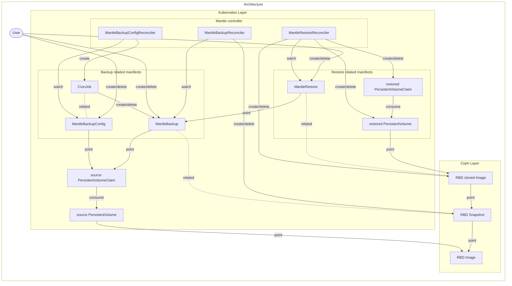

# Design notes

## Motivation

We want to backup and restore RBD PVCs managed by a Rook/Ceph cluster, either by user operation or by periodic automatic processes. Also, we want to copy backup data to another Rook/Ceph cluster in another data center.

## Goal

1. Backup arbitrary RBD PVCs.
2. Restore RBD PVCs from backups.
3. Backup arbitrary RBD PVCs periodically.
4. Copy backup data to another cluster in another data center.

Currently, the goal 1 and 3 are implemented. Other goals will be achieved later.

## Architecture



mantle-controller exists for each Rook/Ceph cluster.

### Backup flow

To create/delete a backup, mantle works as follows:

1. Users create/delete `MantleBackup`.
2. rbd-backupsystem-controller (the controller) gets the target PVC from `MantleBackup`.
3. The controller gets the PV from the target PVC.
4. The controller gets the RBD image name and pool name from the PV.
5. The controller creates/deletes an RBD snapshot corresponding to the backup in the target RBD image.

### Periodic backup flow

To create and rotate backups periodically, Mantle works as follows:

1. Users create a `MantleBackupConfig`.
2. The mantle-controller then creates a `CronJob` based on the `MantleBackupConfig`.
3. The Pod, which is periodically created by the `CronJob`, creates a new `MantleBackup` and deletes any expired `MantleBackup` resources.

If a `MantleBackupConfig` is deleted, the associated `MantleBackup`s won't be removed automatically and won't expire on their own. The users need to delete them manually if they wish to do so.

### Sample manifests

A sample manifest of `MantleBackup` is as follows:

```yaml
apiVersion: mantle.cybozu.io/v1
kind: MantleBackup
metadata:
  name: <MantleBackup resource name>
  namespace: <should be the same as the target PVC>
spec:
  # The name of the backup target PVC
  pvc: <target PVC name>
status:
  conditions:
    # The corresponding backup data is ready to use if `status` is "True"
    - type: "ReadyToUse"
      status: "True"
```

A sample manifest of `MantleBackupConfig` is as follows:

```yaml
apiVersion: mantle.cybozu.io/v1
kind: MantleBackupConfig
metadata:
  name: test-mbc # resource name
spec:
  pvc: test-pvc # target PVC name
  schedule: 0 12 * * * # backup schedule in a crontab format.
  expire: 2w # when the MantleBackups generated by this MantleBackupConfig should expire.
  suspend: false # whether the periodic backup is active or not.
```

### Restore flow

Precondition: Process will not start until conditions are met.
- The target MantleBackup must exist and be ready to use.

1. Users crate a `MantleRestore` resource.
2. The controller gets the target MantleBackup from the `MantleRestore` resource.
3. The controller stores the pool name for the `status.pool` field and cluster ID for the `status.clusterID` field. This value is used to remove the restored PV/PVC when the MantleRestore resource is deleted.
4. The controller gets backup target RBD snap image name from the MantleBackup.
5. The controller creates a new RBD clone from the RBD snap image.
6. The controller creates a new PV/PVC using the new RBD clone.

### Cleanup restore flow

1. Users delete the `MantleRestore` resource.
2. The controller tries to delete the PV/PVC created by the `MantleRestore` resource and wait until the PV/PVC is deleted. If the PV/PVC is used by some pod.
3. The controller removes the RBD clone created by the `MantleRestore` resource. The controller should not remove RBD clone volume specified by the PV.

#### The manifest to get restore PV/PVC from a backup

```yaml
apiVersion: mantle.cybozu.io/v1
kind: MantleRestore
metadata:
  name: <MantleRestore resource name>
  namespace: <should be the same as the target MantleBackup>
spec:
  # The name of the restore target backup
  backup: <MantleBackup resource name>
status:
  conditions:
    # The corresponding restore PV/PVC is ready to use if `status` is "True"
    - type: "ReadyToUse"
      status: "True"
```
